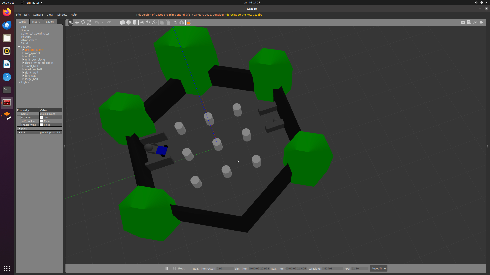
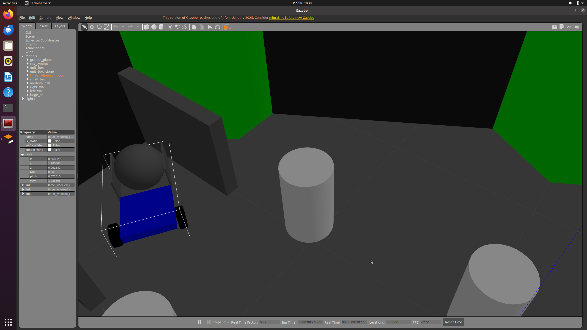

# PDE4430 - Mobile Robotics Coursework2

**Ashwin Murali Thanalapati / M01037932**

This repository contains the ROS packages for simulating a three-wheeled robot, performing SLAM, and enabling autonomous navigation. The project is organized into multiple packages, each handling a specific functionality.

---

## **Packages Overview**

### **1. `pde4430_coursework2`**
This package contains the robot's URDF description, and launch scripts for Gazebo simulation, and RViz visualization.

#### **Key Commands**
- **Launch Gazebo and the robot:**
  ```bash
  roslaunch pde4430_coursework2 cw2_assessment_world.launch
  ```
- **Visualize the robot in RViz:**
  ```bash
  roslaunch pde4430_coursework2 rviz_display.launch
  ```

---

### **2. `pde4430_coursework2_teleop`**
This package handles teleoperation of the robot using the `teleop_twist_keyboard` package.

#### **Key Commands**
- **Start teleoperation:**
  ```bash
  roslaunch pde4430_coursework2_teleop teleop.launch
  ```

The demo video does not move the sphere into the goal. So there are screenshots showing it has been done and is doable:




---

### **3. `pde4430_coursework2_slam`**
This package performs SLAM using Hector SLAM and saves the generated map.

#### **Key Commands**
- **Start Hector SLAM:**
  ```bash
  roslaunch pde4430_coursework2_slam hector_slam.launch
  ```
- **Save the map:**
  ```bash
  rosrun map_server map_saver -f $(find pde4430_coursework2_slam)/maps/my_map
  ```

---

### **4. `pde4430_coursework2_navigation`**
This package enables autonomous navigation using AMCL and move_base.

All code references ROS Navigation stack setup tutorial: https://wiki.ros.org/navigation/Tutorials/RobotSetup

#### **Key Commands**
- **Start navigation:**
  ```bash
  roslaunch pde4430_coursework2_navigation nav_stack.launch # this launches the map and rviz
  rosrun pde4430_coursework2_navigation navigate_to_goal.py # this provides a goal to move_base to move the robot
  ```

---

## **Dependencies**
- ROS Noetic
- Gazebo
- RViz
- `teleop_twist_keyboard`
- `hector_slam`
- `amcl`
- `move_base`

## **Video**

The video demo of the coursework is here: https://youtu.be/-QvWTNUymAg